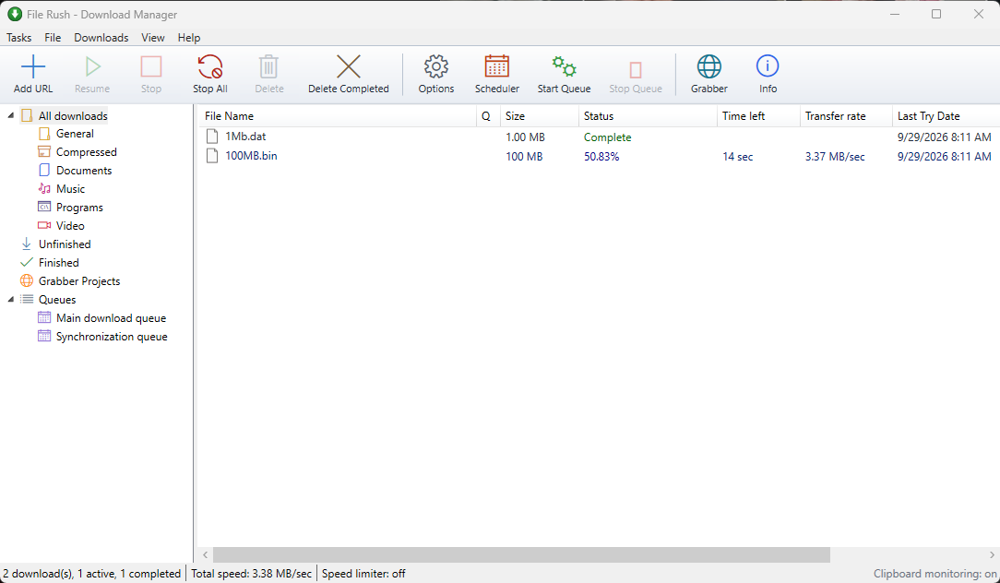
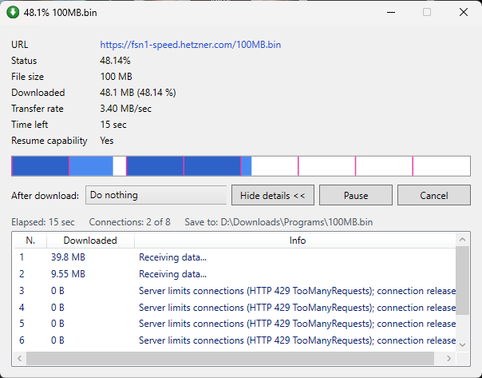
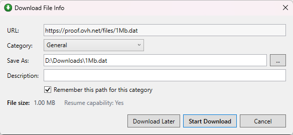
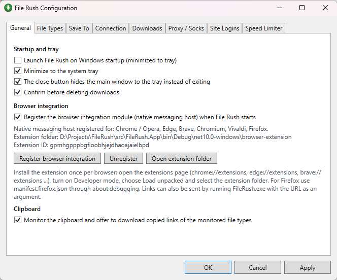
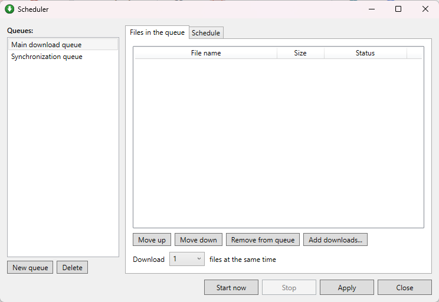

# File Rush

**A fast, open-source download manager and accelerator for Windows.**

File Rush splits every download into segments that are fetched over parallel connections and re-split on the fly, resumes broken or paused downloads exactly where they stopped, organises files into categories and queues, runs on a schedule, and plugs into your browser through an integration extension. It is built with .NET 10 and WPF, ships as a single self-contained executable, and has no telemetry, ads or license nags.



## Features

**Acceleration**
- Up to 32 connections per file with dynamic segmentation: when a connection finishes, it takes a free segment or splits the largest remaining one in half, so every connection stays busy until the last byte.
- Positional file I/O, pooled buffers and a single probing request that doubles as the first data connection.
- Servers that refuse extra connections (HTTP 429/503) get a growing back-off, and a refused connection hands its segment to the others instead of failing the download.

**Resume and reliability**
- Pause, stop and resume at any time. Segment positions are saved every few seconds, so a crash or power loss resumes from the saved state.
- Resume is validated with the file size, ETag and Last-Modified of the remote file; a changed file restarts cleanly.
- Per-connection retries with configurable count and delay; single-connection fallback for servers without range support; unknown-length streams.

**Organisation**
- Categories (Compressed, Documents, Music, Programs, Video, plus your own) with automatic classification by extension and a default folder each.
- Queues with a configurable number of parallel files, a scheduler with start/stop times, days of the week or a one-time date, and a "when done" action (exit, shut down, hibernate, sleep).
- Import and export of the download list, "Move to", "Refresh download address", properties per download.

**Browser integration**
- An integration module for Chrome, Edge, Brave, Vivaldi, Chromium, Opera and Firefox catches downloads the browser starts, catches clicks on links to monitored file types (hold Alt to bypass), sniffs video and audio on the page with a floating "Download video" panel, and adds context-menu items for links, media, all page links or selected links.
- The native messaging host is the application itself and registers automatically on startup.
- Clipboard monitoring and a command-line entry point (`FileRush.exe <url>`) for everything else.

**Capture more**
- Batch downloads with wildcards (`file[001-120].zip`, `img*.jpg` with a numeric or letter range).
- Site grabber: crawl a site to a chosen depth and pick the files to download.
- Add batch downloads from the clipboard.

**Control**
- Global speed limiter, maximum simultaneous downloads, connection timeouts.
- System, HTTP, SOCKS4 and SOCKS5 proxies; per-site logins; per-download credentials, referrer, user agent and cookies.
- Optional virus scan command after completion, download-complete dialog, tray icon with balloon notifications, minimize/close to tray, start with Windows.

## Screenshots

| Download progress with live segments | Download File Info |
| --- | --- |
|  |  |

| Options | Scheduler |
| --- | --- |
|  |  |

## Getting started

1. Download `FileRush.exe` from the [Releases](../../releases) page. It is self-contained, so no .NET runtime installation is needed. Keep the `browser-extension` folder next to it if you want browser integration.
2. Run it once. It creates its settings in `%AppData%\FileRush` and registers the browser integration host for all supported browsers.
3. Add a download with **Add URL**, by copying a link to the clipboard, by running `FileRush.exe https://example.com/file.zip`, or through the browser extension.

### Browser extension

Chromium browsers: open the extensions page (`chrome://extensions`, `edge://extensions`, `brave://extensions`, ...), turn on **Developer mode**, press **Load unpacked** and select the `browser-extension` folder. The extension has a fixed ID, so the registered host already trusts it.

Firefox: rename `manifest.firefox.json` to `manifest.json` in a copy of the folder, load it from `about:debugging#/runtime/this-firefox`, and grant site access in `about:addons`. See [browser-extension/README.md](browser-extension/README.md) for details.

### Command line

```
FileRush.exe https://example.com/file.zip   add a download (forwarded to the running instance)
FileRush.exe --minimized                    start hidden in the tray
FileRush.exe --software                     force WPF software rendering (also FILERUSH_SOFTWARE_RENDER=1)
```

## Building from source

Requirements: Windows 10/11 and the .NET 10 SDK.

```
dotnet build FileRush.sln
dotnet test tests/FileRush.Tests/FileRush.Tests.csproj
dotnet run --project src/FileRush.App
```

Single-file release build:

```
dotnet publish src/FileRush.App -c Release -r win-x64 --self-contained -p:PublishSingleFile=true -p:IncludeNativeLibrariesForSelfExtract=true -o dist
```

## Project layout

| Path | Purpose |
| --- | --- |
| `src/FileRush.Core` | Engine and services with no UI dependency: segmented downloader, speed limiter, queues and scheduler, persistence, batch expander, site grabber, native messaging protocol |
| `src/FileRush.App` | WPF application: main window, tray icon, dialogs, native host mode, browser registration |
| `browser-extension` | Manifest V3 integration module for Chromium browsers and Firefox |
| `tests/FileRush.Tests` | xUnit suite with an in-process HTTP server that supports ranges and fault injection (dropped connections, 5xx replies, throttling, changed files) |

## How the engine works

A download starts with one ranged request that serves as the probe and the first data connection. If the server supports ranges and reports a size, the file is split into equal segments, one per connection, and the partial file is pre-sized. Each connection writes at its own offset with positional I/O and advances its segment; when it finishes, it acquires a free segment or splits the largest active one. Progress, speed and time left are sampled on a timer, and the segment table is persisted so that a later run can resume. On completion the partial file is moved to its final name, with automatic renaming if a file with that name already exists.

## Data

Settings and the download list live in `%AppData%\FileRush` as JSON. Partial files go to `%LocalAppData%\FileRush\Temp` (configurable). Browser host manifests are written to `%LocalAppData%\FileRush\NativeHost` and registered under `HKCU\Software\<browser>\NativeMessagingHosts\com.filerush.host`.

## Notes

- Windows only.
- The browser extension is loaded unpacked; it is not published in the browser stores.
- Streaming formats (HLS, DASH) are not assembled into files; direct video and audio files are.
- File Rush is an independent project and is not affiliated with Tonec or Internet Download Manager.

## License

[MIT](LICENSE)
